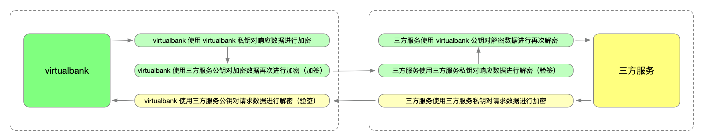

# **请求安全机制**



- 由系统分配给商户端`apiKey`信息。
- 商户端请求时使用 Bearer Token 方式提交 `apiKey` 信息。

```
Authorization: Bearer {{apiKey}}
```

- 请求方法固定使用 `POST` 请求。
- 公私钥算法：**SHA1withRSA**
  - private_key_bits：`1024`
  - private_key_type：`RSA`
  - padding:  `PKCS1`

- 请求数据放在 `body` 中，数据**只使用商户私钥**进行加密，加密数据格式固定为：

```json
{
    "timestamp": 1680070775, // 当前秒级别时间戳
    "params":{ // 请求参数，必传，无参数设置为空对象
        // 请求参数，例如：
        // "pageNo": 1,
        // "pageSize": 50
        // ...
    }
}
```

- Api 响应结果中，data 字段的数据先使用系统私钥进行加密，再使用商户公钥进行加密（加签），所以 data 数据解密需要商户先使用自己的私钥解密，再使用系统的公钥解密（验签），就可以获取响应数据。

示例API响应数据为：

```json
{
    "code": 200,
    "message": "Request succeeded.",
    "data": "eYR3QlcKuPddHKZD/quznFX96EQ5bCgeV1ywwST7qheIYFLCumPDOKeY3EhF+XLuC++32gXW3lBZeCnhqv3gSGIH2XbXEoIZM8jtfRRMqgAJr3xUD+Bsr+gcz5Gmp6qQ4RbpYZTU3ixtAEJ6NzFCuSNAR8UFimEWn8rVVcKJO5lkQ3ZPIgUKZHlwib5fUuXl1vI0drDrjiLFQ9CU4oJOlI5C1SD37Rc/mG2JeJDA8LuyzdyLHgwJNh0jm8UEgWXeYo473Vr8C+WUo6zT5WJw6slPFQPzqUiayE2+JlWVOsfvGeWtUYIg97dbrANd2CRzJNk/90x3l8Sd5jCFFFyCe6sHXMu3JzEt85vhnytejHxXNaTFcpNWdBGB7b68YNHXvlxMx3mkLna6/H3iiR9Hgv+stoCcFnAsQSxABGQE8vNk1Oyfc1w96MkIez9JMl6B1UR7LX/6PCKoiHn+N9vYoihnEzRATaTancbZbWi5gGunWG5PotvRVBo5rvBRH4qX0AkuO6ZiQ5tOTav2NrJLVR2dDO3z14CLfifY32hn8CRHYomDTjcPoBZ06gBC1oSV7Sw5DjwY3ZS+6T7p2TbCaJCfrGzPT2TKF6rDRzzZUrkApakNdRR0J/nYPZ3B+t9/DDInY5Fg+xnsSXPEGvF0TomMb7SwA1K5dsea2fu7gsl9akq8D0R+CY5ZGOCXcsQ01S7akmCKop7daCArqTA9W4MQNHldslyG/uhw8CxFiWR+EL/OVRMSMol1TPpvG6ZJKrIGLSg7R9V6INnFmXmSrwzLzUnT3TnTJ+KB8olblBxlUL7JvakXwb5Py9IPR8J0QWdsdBcRYXYerA+9B3k0AozeXQ9p2eU8AYeVk/n0FrDdjaE3n9RGfabIkD3b+LFkE3tqYdgcWV1OrKIcTmOkvaIPPGrBgd8bC6eOeRSsKUmviFmQVK++WtTT6/ESeDi6lJxX5f3UnGVcHBfxGP4cigqampba7Cau/fPzjWUlQG53WcmFCVl4JS231RFNNMS3vLjtjmRKK++kDJ9fpAlVMPWRitXyI+H/1mQ9+3bKtFNRwbvAlFrNe9Pr3G43iFqS4GoU0DEw/SU4LTN8HekCh+EP7wu1uGF2hf45PD55aRbbxKEYvW4uy6eJqMlIq7jj/kohz1pukNgv0PgD01HztLXESH1xi9JMJgIjImL2J+IOJVToFlDkvtUM77xCgBI69U+Dc6+GOydEypOPouNhiAAVSpGhGfiMXqV7WOXpazDD5VeFKzpnsum85FL+bnnUEom7NS4oE9+Fdg692LGvY337cuiN6nMqy+zgvzxwoLOlGQL/DykwbUYL0nFA/gTu9QFrGmOtrgO9Biwo1rBznpyy+kezWrt/pE4w6XYOBKjmRW4yFm4rsOt6+mooDRxG0XYxYzYI/V12uW/dYq9XAQ0i3JIRxc2rac4TNQv00D1chgqYQ8KhXajkpKZobPJheKyPJjyYu1wMP9OSqic1Ir4g9ZqC6/3TC346Mt1yYbZoQS/JORhrB7wSF9yXq1YGHTTHHlkO9HKGNdnDst0qlurwvItD9r9DnRW2/SEcxLXNLGMXCNm6QlaGuzBySR5z+tLLJ/ODwpUZJtVcsnG8xhdw/1OjHX/J1VpKOLy8q2QMEfCLgWHCWIncqQqwFRzkVUKTMx+KenqCTCeeHNSONFMb/Sa6zx6doxEFtBNerfRTt/C5J2KN53mMVGR8uI0eVBba3kRFVi6V9PKbGVYsoplziYdqXP59T+pklzd9sHK3dmoUqQN5WuZW9hjc6RZPzy1QOf794ZiGcxoJGuPGWbYwR26bc6O+q9+DyUfrNgsK/MZTkavzouF/qnUBbVIRqcTl5imtEBMOND8Vv9exnw==",
    "requestId": "66A8B14FC162B29BF05D1ACAB3D1E617"
}
```

`data` 字段的值为返回的加密数据：

```json
eYR3QlcKuPddHKZD/quznFX96EQ5bCgeV1ywwST7qheIYFLCumPDOKeY3EhF+XLuC++32gXW3lBZeCnhqv3gSGIH2XbXEoIZM8jtfRRMqgAJr3xUD+Bsr+gcz5Gmp6qQ4RbpYZTU3ixtAEJ6NzFCuSNAR8UFimEWn8rVVcKJO5lkQ3ZPIgUKZHlwib5fUuXl1vI0drDrjiLFQ9CU4oJOlI5C1SD37Rc/mG2JeJDA8LuyzdyLHgwJNh0jm8UEgWXeYo473Vr8C+WUo6zT5WJw6slPFQPzqUiayE2+JlWVOsfvGeWtUYIg97dbrANd2CRzJNk/90x3l8Sd5jCFFFyCe6sHXMu3JzEt85vhnytejHxXNaTFcpNWdBGB7b68YNHXvlxMx3mkLna6/H3iiR9Hgv+stoCcFnAsQSxABGQE8vNk1Oyfc1w96MkIez9JMl6B1UR7LX/6PCKoiHn+N9vYoihnEzRATaTancbZbWi5gGunWG5PotvRVBo5rvBRH4qX0AkuO6ZiQ5tOTav2NrJLVR2dDO3z14CLfifY32hn8CRHYomDTjcPoBZ06gBC1oSV7Sw5DjwY3ZS+6T7p2TbCaJCfrGzPT2TKF6rDRzzZUrkApakNdRR0J/nYPZ3B+t9/DDInY5Fg+xnsSXPEGvF0TomMb7SwA1K5dsea2fu7gsl9akq8D0R+CY5ZGOCXcsQ01S7akmCKop7daCArqTA9W4MQNHldslyG/uhw8CxFiWR+EL/OVRMSMol1TPpvG6ZJKrIGLSg7R9V6INnFmXmSrwzLzUnT3TnTJ+KB8olblBxlUL7JvakXwb5Py9IPR8J0QWdsdBcRYXYerA+9B3k0AozeXQ9p2eU8AYeVk/n0FrDdjaE3n9RGfabIkD3b+LFkE3tqYdgcWV1OrKIcTmOkvaIPPGrBgd8bC6eOeRSsKUmviFmQVK++WtTT6/ESeDi6lJxX5f3UnGVcHBfxGP4cigqampba7Cau/fPzjWUlQG53WcmFCVl4JS231RFNNMS3vLjtjmRKK++kDJ9fpAlVMPWRitXyI+H/1mQ9+3bKtFNRwbvAlFrNe9Pr3G43iFqS4GoU0DEw/SU4LTN8HekCh+EP7wu1uGF2hf45PD55aRbbxKEYvW4uy6eJqMlIq7jj/kohz1pukNgv0PgD01HztLXESH1xi9JMJgIjImL2J+IOJVToFlDkvtUM77xCgBI69U+Dc6+GOydEypOPouNhiAAVSpGhGfiMXqV7WOXpazDD5VeFKzpnsum85FL+bnnUEom7NS4oE9+Fdg692LGvY337cuiN6nMqy+zgvzxwoLOlGQL/DykwbUYL0nFA/gTu9QFrGmOtrgO9Biwo1rBznpyy+kezWrt/pE4w6XYOBKjmRW4yFm4rsOt6+mooDRxG0XYxYzYI/V12uW/dYq9XAQ0i3JIRxc2rac4TNQv00D1chgqYQ8KhXajkpKZobPJheKyPJjyYu1wMP9OSqic1Ir4g9ZqC6/3TC346Mt1yYbZoQS/JORhrB7wSF9yXq1YGHTTHHlkO9HKGNdnDst0qlurwvItD9r9DnRW2/SEcxLXNLGMXCNm6QlaGuzBySR5z+tLLJ/ODwpUZJtVcsnG8xhdw/1OjHX/J1VpKOLy8q2QMEfCLgWHCWIncqQqwFRzkVUKTMx+KenqCTCeeHNSONFMb/Sa6zx6doxEFtBNerfRTt/C5J2KN53mMVGR8uI0eVBba3kRFVi6V9PKbGVYsoplziYdqXP59T+pklzd9sHK3dmoUqQN5WuZW9hjc6RZPzy1QOf794ZiGcxoJGuPGWbYwR26bc6O+q9+DyUfrNgsK/MZTkavzouF/qnUBbVIRqcTl5imtEBMOND8Vv9exnw==
```

先使用商户私钥进行解密：

*示例商户私钥：*

```
MIICdwIBADANBgkqhkiG9w0BAQEFAASCAmEwggJdAgEAAoGBAN8jis4QmENuaBWMRAHn2meTisHHfCGvJDee513Ag6IzHWFURaYf/tlx7pmaVFWqsdQKuvj8wJEnjmPcuIocWqbGMVE3k0o18Z5gFRmLOz68DDOMW/uXAOcjgcmPusuJvqD3cdtztONVnJjCTmMggtVex0QJgMkHtdOa37IhvQl1AgMBAAECgYEA3Gv8uvBTqRDQSrDjoUpKSlTKFgAcFB4x1avn+4mnvrtlg3a+0or6sgxE2YFFW9ahkcgDyN/MzdbYZrdrqCq4M/uLS+quWeM7tvasunHcQ+2iolaYu73dOFidoS2KYAc5uX0DuqF51cm8etKo4sIiVa2Kn6xWd4FfXJ3v/aZ5rcUCQQD/WL9ynfw04a3OccNyW0hik5ZnHnAzifT+TrjGZOWrI6tYWBo0PFripm3WTR2Rd3FaXsdclEn1NnEq+PTXvA5fAkEA37WyvqRfeNxNnOvFfRQ3PZhDtZHPZJV39fgMQQ4Qqj0s7o7pWBi7768yaS5FPAPNlS/sXKyECh9xwk2sKTaQqwJAdPnsIo7bhkJIxEV7mvzUaUxhX3YjQokVshbQMRrx1/fsO/mIb5uiqyhBMyZ6wDQuuo6m1/Oa+fnp2Bza1aXyEwJAE1nfRVhoncbIu+s1IRWvlZdnO/yJ6RR41QEI5lO2I1O5YEVib+lr0FbiUHDdMkzN6rrDgly16z4/E+SuIL6EkwJBAPTWrhR+IZQUYqqubHOxIVjGnAddSWTzzPrhjeNwvw93NHcGeAilmhSsIwj32wHBRZAln+Eiae4FzMjNSpZnVZ4=
```

*商户私钥解密后数据:*

```json
JIRwlSEfUJkYWMBGOeorXaDc921ZQInFSRn9NJEq3rGeBGxpXXnKIquz02p7NH/Qe1E9m+MkWrCPFQew8i1Sh+qk/T+0MfkCHJeoQrRoWHbggmhSBticNpqtie6yLG3AUHWa9mu/ZdDMioBrKIk6SJYKczrOkKggPFMQzRuPziY9ow7T3OMPRUlTN3VqSnOoGstqVhsNfCU3/EZ28PS5/zECEQTjE+0hG7mt6XVZNIKggikVp/nnLBItv/i5wt/Uptj+CeorDByS8oNEBIlWkhtcA8XHn0bMsux5IXWaOgiPVkV6Co0bTFZKWP4Y9JmzZlmfEgCIDN+ghASqOx8acjV5eVjrMc6EwgV3JcPA80EzcILUTCEidWXqexTTqhKKMBGOmyw7zDJ+hUu7DWZt6AycZf3Q1eqQ3jiUCN0nVJri/dINDi5L4CTj4xf7Dohcg6Cj6KoM9xbXMQHDDw3ERAPCAKqh4THAQtaWM7FrJd1q2OfyF0CMt7ypXaiW5yfrYNDnAPnaDrkySvIPJmzyrg9vloAtCQU8Nm6Sd79npywfpzsWqx8hvdoruZHDyMpOVDkY48CWuUrBhUc1j0x3+JaBmls4t+rxOhOsBCozumZ6sHfTg+p2eM13/jOOpx0reYmVEqN8olQunbHpByxhD7Qb3u2E+jMSSJSPvy1vRM6PJxGb9gPxbLh2rumhNrW3Myq3rcLNAhCKm2+OALAN04XUhu83urrGHBnK7Jw01ArxgZQFdGxGbN/XSXfqZz2D+T1K2tfvyZt1fRbmC003IUGFa6B30v/WfeYacdMra9yN4TkGgBt8YF9/i0oqQbjQuRDZ82t8vjlW6oK0E+YCdoqYQYVHPNsG+NJ1CKVDO0dzdXhH5g7xc/IgNWEgmDPjr6+iWEEp2MgebjER+QUxrjZP/qpOGCIwNcHWrmYsIJuYnn/D1QATJdmEM9ECzdLvY7PlmlUIS1Tn/DhSBgzOOiAKoFb3duT+Ol+EYyENfnQM7+XESnAbwKSDdYKAzV7CwCawAhSNz/mWWknOAfSFUKWXtAw09qVB/o5+ZNgy+XWnZu33+amRfgwFjwYayKmZ6WUynWpNiIIs/6FJl2MfgEOPdPlR+QVBPkfsaCd7nNpSpT4HWjtREJHQkIVM3bpaoSbUc5aQtWpTDUkTFICJwYa/SG0dbo9hQFeUUP34XvU=
```

再使用系统公钥进行解密：

*示例系统公钥:*

```
MIGfMA0GCSqGSIb3DQEBAQUAA4GNADCBiQKBgQDEbOFZ/7O6ywTZN9+20RY5CaqPDH7NAit2PbUWIhOJLxQ+w0WO6qaTpqQvbT56DBodYqMwrTTUTFglGZ9CRp+MCJxILi3aBt8z4LAnUMizaMbhRd+BrR9uOeemz7EvrTfeNr1LRReXfaqW7Wt9q3Fei8jtXUFJ8bUgMKIwG9oEUwIDAQAB
```

*系统公钥解密后数据:*

```json
[{"bankcode":"114db","bankname":"The National Commercial Bank"},{"bankcode":"11558","bankname":"The Saudi British Bank"},{"bankcode":"115d5","bankname":"Saudi Investment Bank"},{"bankcode":"11652","bankname":"alinma bank"},{"bankcode":"116cf","bankname":"Banque Saudi Fransi"},{"bankcode":"1174c","bankname":"Riyad Bank"},{"bankcode":"117c9","bankname":"Samba Financial Group (Samba)"},{"bankcode":"11846","bankname":"alawwal bank"},{"bankcode":"118c3","bankname":"Al Rajhi Bank"},{"bankcode":"11940","bankname":"Arab National Bank"},{"bankcode":"119bd","bankname":"Bank AlBilad"},{"bankcode":"11a3a","bankname":"Bank AlJazira"},{"bankcode":"11ab7","bankname":"Gulf International Bank Saudi Aribia (GIB-SA)"}]
```